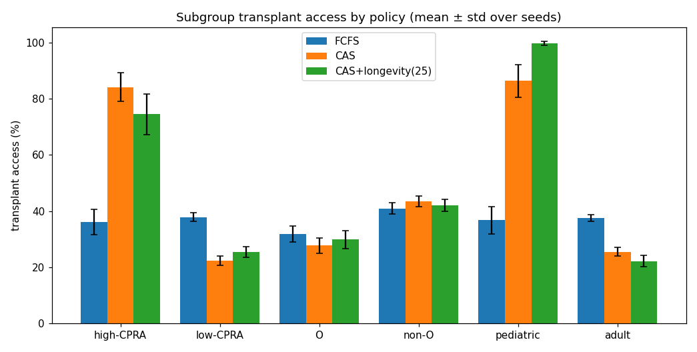
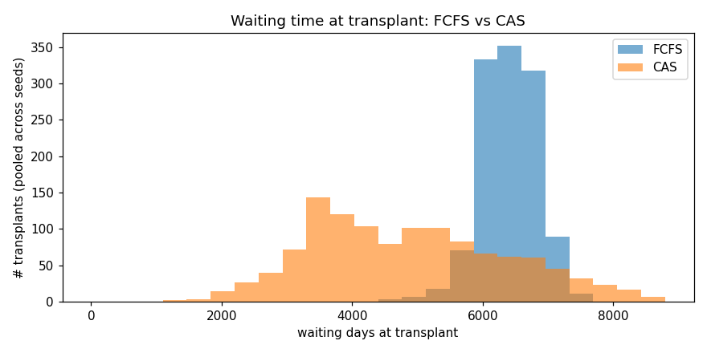
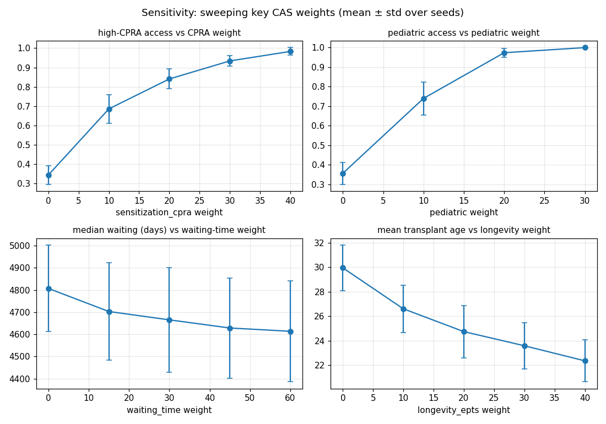

# Evaluation results — Phase 5 (metrics)

> Generated by `python -m evaluation.run` over **30 seeds**. **Framing:** these describe **what the mechanism does** — the relative trade-offs each policy makes — NOT a proof of real-world fairness, which synthetic data cannot establish. **± is the standard deviation ACROSS seeds** (seed-to-seed spread); the 95% CI of the mean is ~√n tighter (≈ ÷5.5 here).

**Config:** 400 recipients, 150 deceased donors, 30 seeds (0–29), longevity weight (on) = 25. Synthetic India ABO/HLA/CPRA distributions (engine/data_gen.py).

## Equity: FCFS vs CAS vs CAS+longevity

| metric (mean ± std) | FCFS | CAS | CAS+longevity(25) |
|---|---|---|---|
| transplants | 150 ± 0 | 150 ± 0 | 150 ± 0 |
| overall transplant rate | 38% ± 0 | 38% ± 0 | 38% ± 0 |
| high-CPRA (≥80) access | 36% ± 4 | 84% ± 5 | 75% ± 7 |
| low-CPRA access | 38% ± 1 | 22% ± 2 | 26% ± 2 |
| blood-type-O access | 32% ± 3 | 28% ± 3 | 30% ± 3 |
| non-O access | 41% ± 2 | 43% ± 2 | 42% ± 2 |
| pediatric (<18) access | 37% ± 5 | 86% ± 6 | 100% ± 1 |
| adult access | 38% ± 1 | 26% ± 1 | 22% ± 2 |
| median waiting at transplant (days) | 6422 ± 115 | 4665 ± 235 | 4597 ± 240 |
| mean age transplanted | 39.2 ± 1.7 | 30.0 ± 1.9 | 24.3 ± 2.1 |
| mean CPRA transplanted | 26.6 ± 3.9 | 56.5 ± 3.9 | 50.2 ± 3.9 |

### Subgroup denominators — what each % is *out of*

| subgroup | recipients (of 400) |
|---|---|
| high-CPRA (≥80) | 99 ± 11 |
| low-CPRA | 301 ± 11 |
| blood-type-O | 151 ± 11 |
| non-O | 249 ± 11 |
| pediatric (<18) | 79 ± 9 |
| adult | 321 ± 9 |

### What the numbers say

- **High-CPRA (sensitized) access**: FCFS 36% → CAS 84% — CAS prioritizes hard-to-match patients (cost: low-CPRA 38% → 22%).
- **Pediatric access**: FCFS 37% → CAS 86% → +longevity 100% (cost: adult 38% → 26%).
- **Blood-type-O disadvantage**: under CAS O 28% vs non-O 43% — PERSISTS (an ABO-compatibility effect, not fixed by scoring; FCFS O 32% vs 41%).
- **Waiting time at transplant**: FCFS median 6422d (pure queue) vs CAS 4665d.
- **Longevity tension**: mean transplant age CAS 30 → +longevity 24 — maximizing life-years disadvantages older patients (so it is weight-0 by default).





## Sensitivity — the weights are tunable dials (mean ± std over seeds)

- **high-CPRA access vs CPRA weight**: 0.34 ± 0.05 (w=0) → 0.98 ± 0.02 (w=40).
- **pediatric access vs pediatric weight**: 0.36 ± 0.06 (w=0) → 1.00 ± 0.00 (w=30).
- **median waiting (days) vs waiting-time weight**: 4806.92 ± 195.28 (w=0) → 4613.67 ± 227.61 (w=60).
- **mean transplant age vs longevity weight**: 29.95 ± 1.86 (w=0) → 22.35 ± 1.71 (w=40).



## Systems metrics (illustrative — one machine, single-process Python, one seed)

- throughput: **407.2 allocations/s** (150 allocations in 0.3684s)
- single-match latency: **2.79 ms** to rank a 400-recipient waitlist

On-chain gas/op (illustrative; `cd contracts && npx hardhat run scripts/gas.js`):

| op | gas |
|---|---|
| registerRecipient | 90,716 |
| registerDonor | 46,178 |
| logDecision (pool=5) | 72,391 |
| eraseRecipient | 29,017 |

## Reproduce
```
pip install -r requirements.txt
python -m evaluation.run
```
